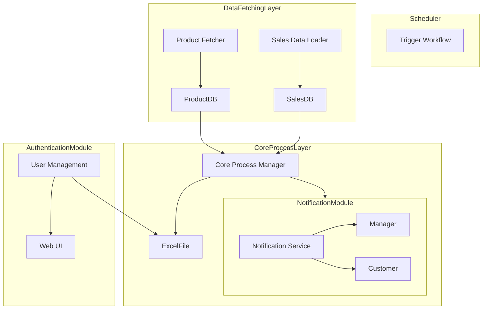

# Development View

## Purpose of the Development View
The Development View focuses on the **organization of the codebase**, including modules, packages, and layers. It helps developers understand dependencies between components and assists in defining build and deployment workflows.

---

## Key Elements to Include for Your Product

### 1. **Modules and Layers**
- **Scheduler Module**: Handles automatic triggers.
- **Data Fetching Layer**: Fetches product and sales data.
- **Core Process Layer**: Generates price adjustment suggestions.
- **Notification Module**: Manages communication with users and managers.
- **Authentication Module**: Manages user login and permissions.
- **Database Layer**: Stores product and sales data.
- **UI Layer**: Provides web pages to display product and sales reports.

### 2. **Technologies or Dependencies**
- **Backend Framework**: .NET, Django, or FastAPI (depending on your stack).
- **Database**: MySQL or PostgreSQL.
- **Scheduling Library**: cron jobs or Celery (for Python).
- **Excel Library**: openpyxl or Pandas for Excel generation.
- **Authentication**: OAuth or JWT for login management.

---

## Development View Component Diagram

