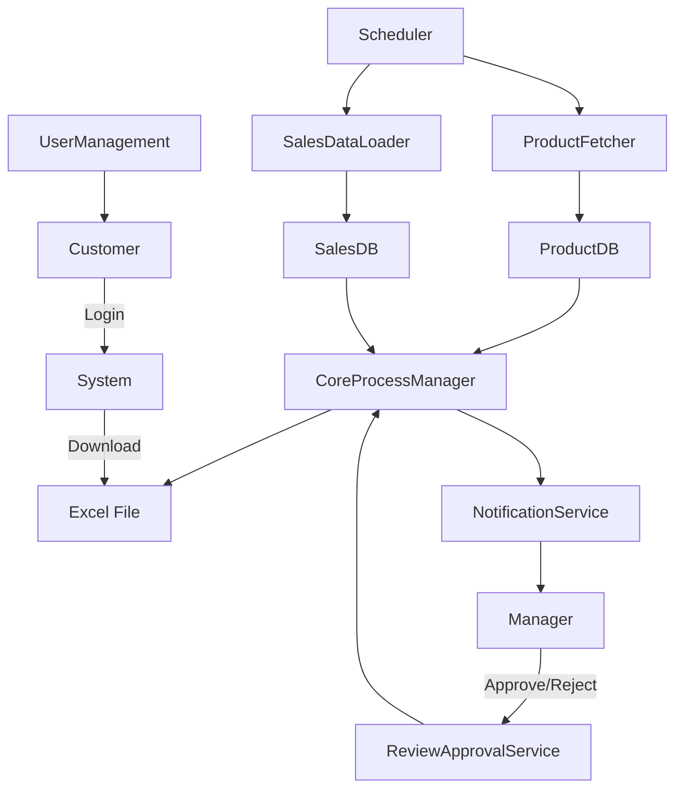
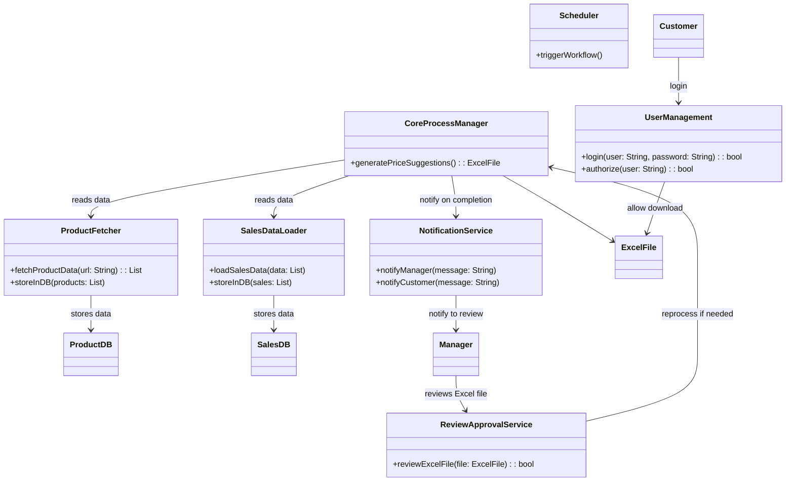

## Logical View:

### Logical View Purpose:
Describes the key components, services, and classes.
Helps developers understand how the business logic is structured.
Focuses on relationships and dependencies between components.

* Scheduler Module
Triggers the entire workflow every Sunday at 1 AM.

* Product Fetcher Module
Fetches product data from customers' websites.
Stores product information in the ProductDB.
* Sales Data Loader Module
Receives and loads the latest sales data into the SalesDB.
* Core Process Manager Module
Reads from ProductDB and SalesDB.
Generates price adjustment suggestions in Excel format.
* Notification Service
Sends notifications to the Manager about product and sales data changes.
Notifies the Customer when the new suggestion is ready.
* Review & Approval Service
Handles Manager’s review and approval process.
Ensures only approved suggestions are released.
* User Management Module
Manages authentication (login) and authorization.
Controls user access to product availability and report downloads.

