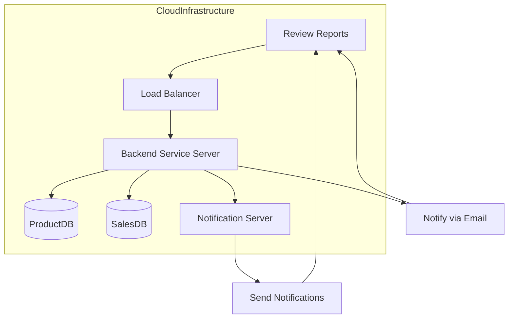

# Physical View

## Purpose of the Physical View
The Physical View describes the **infrastructure and deployment architecture** of the system. It shows how the system is distributed across **servers, databases, and networks** to ensure scalability, fault tolerance, and performance.

---

## Key Elements for Your Product’s Physical View

1. **Web Server**:
   - Hosts the **web UI** for customer interaction (e.g., login, download reports).

2. **Backend Service Server**:
   - Handles core functionalities like **product fetching, sales data loading**, and **price adjustment generation**.
   - Runs tasks on **scheduled triggers** (e.g., cron jobs).

3. **Database Server**:
   - Hosts **ProductDB** and **SalesDB** for storing product and sales data.
   - Uses **SQL databases** (e.g., MySQL or PostgreSQL) for structured storage and querying.

4. **Notification Server**:
   - Manages **email or messaging notifications** to the **Manager** and **Customer**.

5. **Load Balancer**:
   - Distributes incoming traffic to **multiple web and backend servers** to ensure high availability.

6. **Cloud Deployment (e.g., AWS, Azure, or GCP)**:
   - Deploy the entire system on **cloud infrastructure** with auto-scaling capabilities.

---

## Physical View Deployment Diagram

