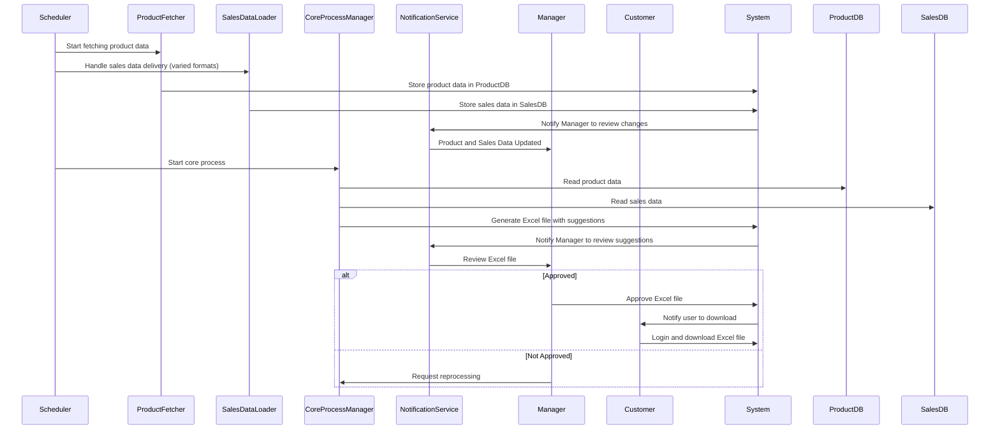

# Process View

## Purpose of the Process View
The Process View describes the **dynamic interactions** between components and modules at runtime. It focuses on how processes run, exchange information, and handle **performance and concurrency**. 

Given that **sales data is provided by customers** in **different formats** and with **varied delivery methods**, this process is kept **flexible and open**.

---

## Key Scenarios to Include

1. **Automated Workflow Execution**  
   - The **Scheduler** triggers the process at **1 AM every Sunday**.
   - **ProductFetcher** runs to fetch the latest product data from the retailer’s website.
   - **Sales Data Loader** handles the incoming sales data flexibly, supporting multiple formats and delivery methods (e.g., CSV, JSON, APIs, FTP).

2. **Notification Process**  
   - After data fetching and loading, **notifications** are sent to the **Manager** to review the updates.

3. **Core Process Execution**  
   - The **Core Process Manager** reads product and sales data from the databases.
   - It generates **price adjustment suggestions** in Excel format and sends them to the **Manager** for approval.

4. **Approval and User Interaction**  
   - If the **Manager** approves the suggestions, the **Customer** is notified to download the Excel file.
   - If not, the process is **restarted** for reprocessing.

---

## Process View Sequence Diagram

