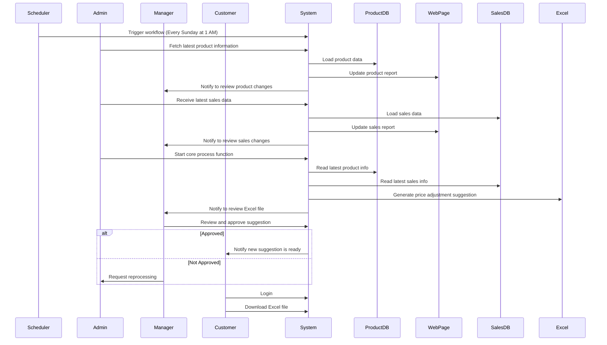

### Typical scenario
There are 3 primary user roles: customer, admin, manager.
Critical scenarios or use cases your system must support.
Example:
User logs in, browses result, and download the result, once per week.
Admin maintain the codes that 1, fetching data from client's store front; 2, process the data into result; 3, provide download service.
Manager monitors the status of the running service, tweak the parameters of fetching and processing the data, QC the results, and controls user's authority, and product's availability.

### The product key workflow
1. The product is to provide price adjust suggestion for retailers' products, e.g. women handbags;
2. fetch latest product information from a customer(online retailer)'s website, including product SKU, product description, price, images. Load the product information into product DB;update a webpage that shows a brief report about the changes of products data, notify manager to review;
3. Receive latest sales data of fetched products, load into sales DB, update a webpage that shows a brief report about the changes of sales data, notify manager to review; 
4. Start the core process function, which read latest products info and sales info, generate price adjust suggestion, in format of excel file; notify manager to review;
5. Manager review and approve the excel file is good to release.
6. Finish all process within 12 hours and notify the user that a new suggetion is ready to download;
7. User login and download the excel file.
8. The codes are running automatically and is triggered by time, e.g, every Sunday 1am.

