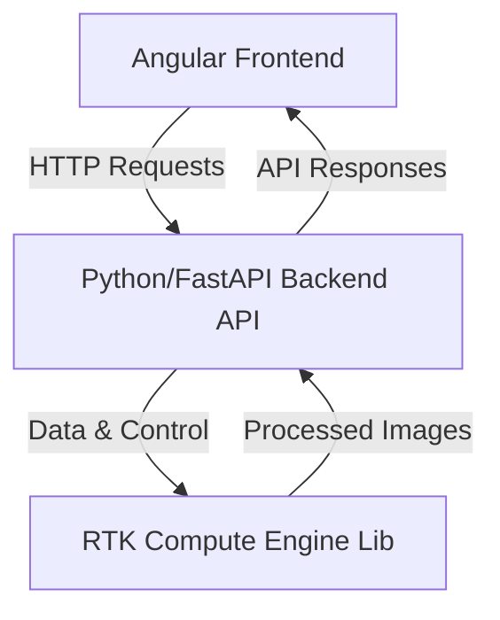
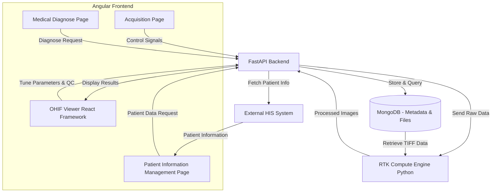

---

### Explanation of the Architecture

1. **Angular Frontend**:
   - Sends HTTP requests to the backend to interact with the RTK compute engine (e.g., for reconstruction tasks or image processing).

2. **Backend API**:
   - Acts as the mediator between the frontend and RTK. 
   - The backend validates input, manages sessions, and calls the RTK compute engine to perform processing.

3. **RTK Compute Engine**:
   - Processes requests from the backend (such as performing CBCT reconstruction) and sends the results back.

This architecture offers a **decoupled, modular system** where each layer communicates via **well-defined APIs**, making it scalable and easy to maintain. Let me know if you'd like further customization or more details!

--- 

---

### Explanation of the Updated Workflow

1. **Acquisition Page**:
   - **Controls X-ray machine** operations and collects raw scan data.
   - Sends the data and scan metadata to the **FastAPI backend**.

2. **OHIF Viewer (Reconstruction & QC)**:
   - Users can **tune reconstruction parameters** and perform **quality control (QC)** on images interactively.
   - The **OHIF Viewer** fetches results from the backend for QC display.

3. **Medical Diagnose Page**:
   - Medical personnel review the processed images and provide **diagnostic input**.
   - Can trigger additional **reconstruction or QC requests** if necessary.

4. **Patient Information Management Page**:
   - Displays **patient records** retrieved from the external **HIS system**.
   - Allows integration with patient workflows, including linking imaging data to patient records.

5. **FastAPI Backend**:
   - Acts as the **bridge between front-end pages, the RTK compute engine, MongoDB, and external HIS**.
   - Orchestrates communication and **fetches patient information from the HIS**.

6. **RTK Compute Engine (Python)**:
   - Receives raw data from the backend and performs **image reconstruction**.
   - Sends reconstructed images back to the backend for QC and diagnosis.

7. **MongoDB with GridFS**:
   - Stores scan metadata and large TIFF files efficiently using **GridFS**.
   - Supports **fast retrieval of imaging data** for QC and diagnosis.

8. **External HIS System**:
   - **Handles patient data** and integrates with the backend for seamless access.
   - Ensures that the imaging data and patient records are correctly linked.

---

### Benefits of This Architecture

- **Seamless HIS Integration**: The **Patient Information Management Page** connects directly to the external HIS, ensuring up-to-date patient data access.
- **Scalable and Modular**: The use of **FastAPI**, MongoDB, and RTK provides a modular architecture, ideal for handling large imaging files and metadata.
- **Interactive Imaging Workflow**: With the **OHIF Viewer**, users can fine-tune and QC images on the fly.
- **Cross-platform Support**: This setup ensures the application runs smoothly across platforms, whether deployed on **local or cloud-based infrastructure**.

This enhanced design ensures your application is **well-integrated, maintainable, and scalable** for real-world medical imaging environments. Let me know if further changes are required!

