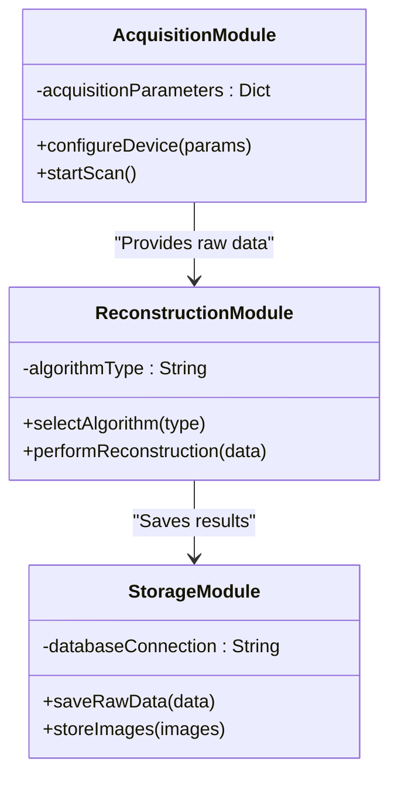

## Development view

```mermaid
classDiagram
    class AcquisitionModule {
        -acquisitionParameters : Dict
        +configureDevice(params)
        +startScan()
    }
    class ReconstructionModule {
        -algorithmType : String
        +selectAlgorithm(type)
        +performReconstruction(data)
    }
    class StorageModule {
        -databaseConnection : String
        +saveRawData(data)
        +storeImages(images)
    }
    AcquisitionModule --> ReconstructionModule : "Provides raw data"
    ReconstructionModule --> StorageModule : "Saves results"

```