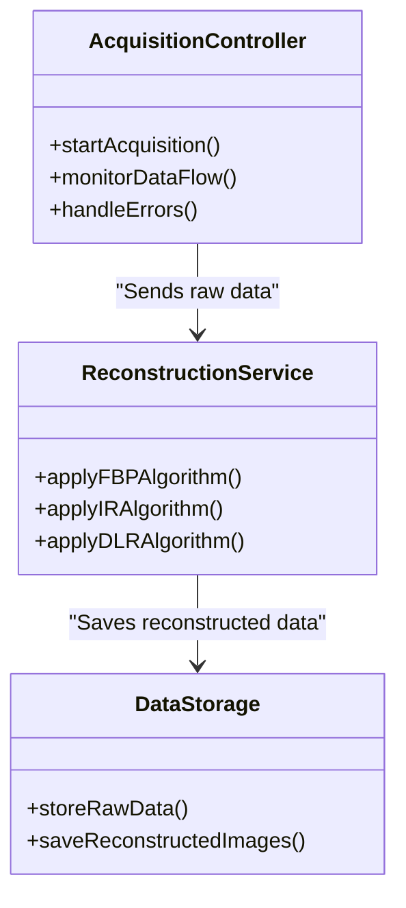

## Logical View

```mermaid
classDiagram
    class AcquisitionController {
        +startAcquisition()
        +monitorDataFlow()
        +handleErrors()
    }
    class ReconstructionService {
        +applyFBPAlgorithm()
        +applyIRAlgorithm()
        +applyDLRAlgorithm()
    }
    class DataStorage {
        +storeRawData()
        +saveReconstructedImages()
    }
    AcquisitionController --> ReconstructionService : "Sends raw data"
    ReconstructionService --> DataStorage : "Saves reconstructed data"
```