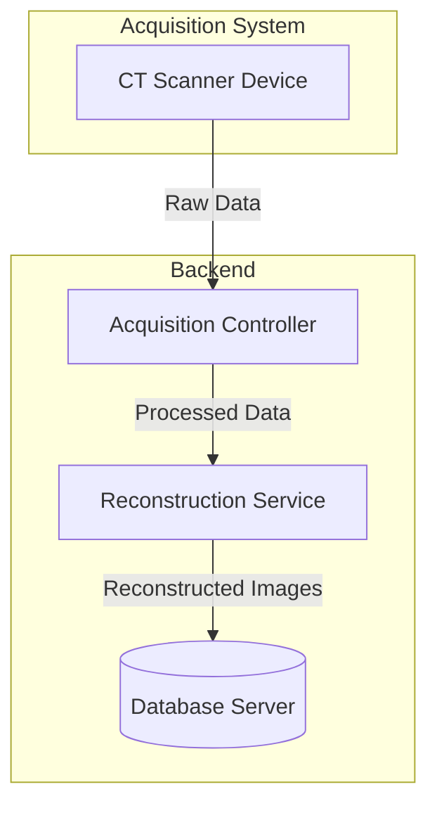

## Physical View

```mermaid
graph TD
    subgraph Acquisition System
        AcquisitionDevice[CT Scanner Device]
    end

    subgraph Backend
        AcquisitionControllerService[Acquisition Controller]
        ReconstructionServiceComponent[Reconstruction Service]
        DatabaseServer[(Database Server)]
    end

    AcquisitionDevice -->|Raw Data| AcquisitionControllerService
    AcquisitionControllerService -->|Processed Data| ReconstructionServiceComponent
    ReconstructionServiceComponent -->|Reconstructed Images| DatabaseServer
```