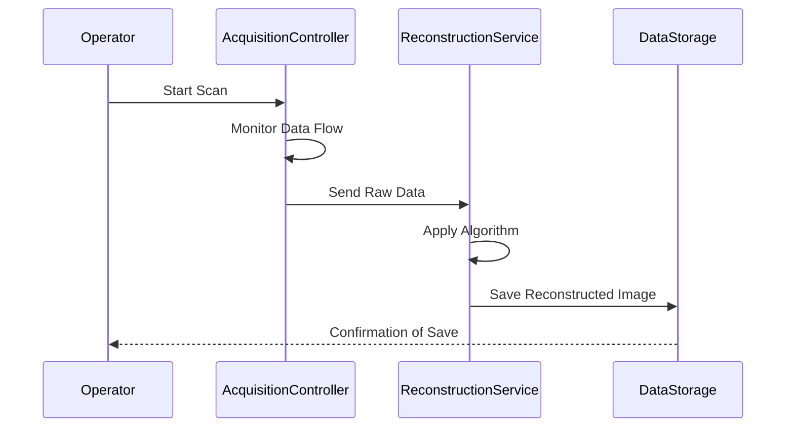

## Proces View

```mermaid
sequenceDiagram
    participant Operator
    participant AcquisitionController
    participant ReconstructionService
    participant DataStorage

    Operator->>AcquisitionController: Start Scan
    AcquisitionController->>AcquisitionController: Monitor Data Flow
    AcquisitionController->>ReconstructionService: Send Raw Data
    ReconstructionService->>ReconstructionService: Apply Algorithm
    ReconstructionService->>DataStorage: Save Reconstructed Image
    DataStorage-->>Operator: Confirmation of Save

```