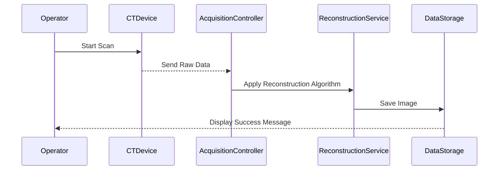

## Scenarios View: Image Acquisition Process

```mermaid
sequenceDiagram
    participant Operator
    participant CTDevice
    participant AcquisitionController
    participant ReconstructionService
    participant DataStorage

    Operator->>CTDevice: Start Scan
    CTDevice-->>AcquisitionController: Send Raw Data
    AcquisitionController->>ReconstructionService: Apply Reconstruction Algorithm
    ReconstructionService->>DataStorage: Save Image
    DataStorage-->>Operator: Display Success Message
```